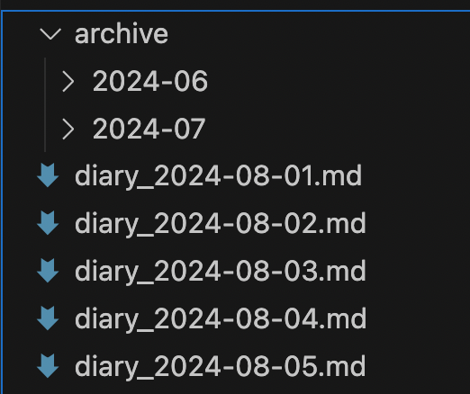

数年使い続けた結果、いろいろと問題点が出てきたので直したい。

# コンフィグファイルの導入

コマンドライン引数で渡していた以下の設定項目をコンフィグファイルから渡すようにする。  

| 設定項目                   | 設定値の例                              | required/optional (default) |
| :------------------------- | :-------------------------------------- | :-------------------------- |
| 名前                       | diary                                   | required                    |
| ベースディレクトリのパス   | /Users/rishikawa/memo/diary             | required                    |
| テンプレートファイルのパス | /Users/rishikawa/memo/diary/template.md | optional                    |
| アーカイブ時のサマリ出力   | enabled / disabled                      | optional, default: disabled |

テンプレートファイルは指定しなかった場合には何も記述されない。  
パスはフルパスを指定する。  

# ディレクトリ構造の変更

ディレクトリが深くなる問題がある。  


ファイル名を `日付_名前.md` の形式とし、ディレクトリを掘らない。  



# アセットディレクトリ

画像、動画、PDFなどを日記に添付するケースを考慮する。  
https://code.visualstudio.com/docs/languages/markdown#_inserting-images-and-links-to-files  

アーカイブ時にはアセットディレクトリも一緒に動かす。  
ディレクトリ名は固定で `assets` とする。  

# メタデータを固定で付与する

YAML構文 `---` でファイルの先頭にメタデータを付与する。  

```markdown
---
title: diary
date: 2024-08-01
---
```

`title` は後述するコンフィグファイルで指定されたものが入る。  
`date` は `init` コマンドを実行した際の現在時刻が入る。  

# アーカイブ時のサマリ出力

各ファイルのパスと見出しをアーカイブ時に出力できるようにする。  
有効・無効はコンフィグファイルから行えるようにする。  

```markdown
---
title: archived diary
date: 2024-09-01
---

- [diary.md](diary_2024-08-01.md)
  - 見出し1
    - 見出し2
  - 見出し1
    - 見出し2
- [diary.md](diary_2024-08-02.md)
  - 見出し1
    - 見出し2
  - 見出し1
    - 見出し2

...
```

# アーカイブ時はファイルのメタデータをもとにアーカイブする

ファイルの接頭辞をもとにアーカイブするファイルを選択していたが、`date` をもとに月次のアーカイブを行えるようにする。

# v1 と　v2 のマイグレーション

基本的には諦める...
